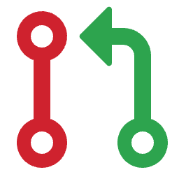

#  noPR: Filter GitHub Issues with(out) Linked PR

> Browser extension that adds a simple filter to GitHub issues page to show issues with or without linked pull requests

Working with GitHub issues often requires identifying which issues have associated pull requests and which don't. This extension makes that task easy with a simple dropdown filter in the GitHub issues toolbar.

## Install

[link-chrome]: https://chrome.google.com/webstore/detail/your-extension-id 'Version published on Chrome Web Store'
[link-firefox]: https://addons.mozilla.org/firefox/addon/your-extension-id/ 'Version published on Mozilla Add-ons'

[][link-chrome] [][link-chrome] and other Chromium browsers

[][link-firefox] [][link-firefox]

Or [install locally](#install-locally) from source.

## Features

<table>
  <tr>
    <th width="50%">
      <p>Filter issues with linked PRs</p>
      <p></p>
    </th>
    <th width="50%">
      <p>Filter issues without linked PRs</p>
      <p></p>
    </th>
  </tr>
  <tr>
    <th width="50%">
      <p>Seamless integration with GitHub's UI</p>
      <p></p>
    </th>
    <th width="50%">
      <p>Works with all GitHub themes</p>
      <p></p>
    </th>
  </tr>
</table>

## How It Works

- 🔍 Adds a dropdown filter button to GitHub issues pages
- 🟢 Easily find issues with linked pull requests
- 🔴 Quickly identify issues without linked pull requests
- 🔄 Works with GitHub's modern SPA navigation
- 🎨 Seamlessly matches GitHub's design in both light and dark modes

The extension adds a visually distinctive red and green icon to GitHub's issue toolbar. Clicking it reveals a dropdown with three options:

1. **No Filter**: Show all issues (default)
2. **Issues with Linked PR**: Show only issues that have associated pull requests
3. **Issues w/o Linked PR**: Show only issues that don't have associated pull requests

The filter works by adding `linked:pr` or `-linked:pr` to GitHub's search query, making use of GitHub's built-in search functionality.

## Usage

1. Navigate to any GitHub repository's issues page
2. Look for the red and green pull request icon in the toolbar
3. Click it to show the dropdown menu
4. Select one of the three filtering options

## Install Locally

If you prefer to install the extension directly from source, click to expand the instructions below.

<details>

<summary>Local Installation Instructions</summary>

### Chrome / Edge / Brave (and other Chromium browsers)

1. Download or clone this repository:
   ```
   git clone https://github.com/sshkhr/noPR.git
   ```

2. Open Chrome and navigate to `chrome://extensions/`

3. Enable "Developer mode" in the top-right corner

4. Click "Load unpacked" and select the downloaded/cloned directory

5. The extension should now be installed and active on GitHub issue pages

### Firefox

1. Download or clone this repository:
   ```
   git clone https://github.com/sshkhr/noPR.git
   ```

2. Open Firefox and navigate to `about:debugging#/runtime/this-firefox`

3. Click "Load Temporary Add-on..."

4. Select the `manifest.json` file from the downloaded/cloned directory

5. The extension will be installed temporarily (until Firefox is restarted)

Note: For permanent installation in Firefox, the extension needs to be signed by Mozilla.

</details>

## Contributing

Please see [CONTRIBUTING.md](CONTRIBUTING.md) for development setup and contribution guidelines. If you find any bugs or errors, please open an issue or send a pull request.

## License

This project is licensed under the MIT License - see the LICENSE file for details.

## Acknowledgments

- GitHub for their excellent search API and `linked:pr` search syntax
- [Refined GitHub](https://github.com/refined-github/refined-github) extension for inspiration and UI design patterns