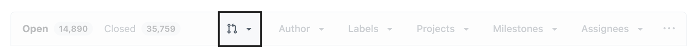
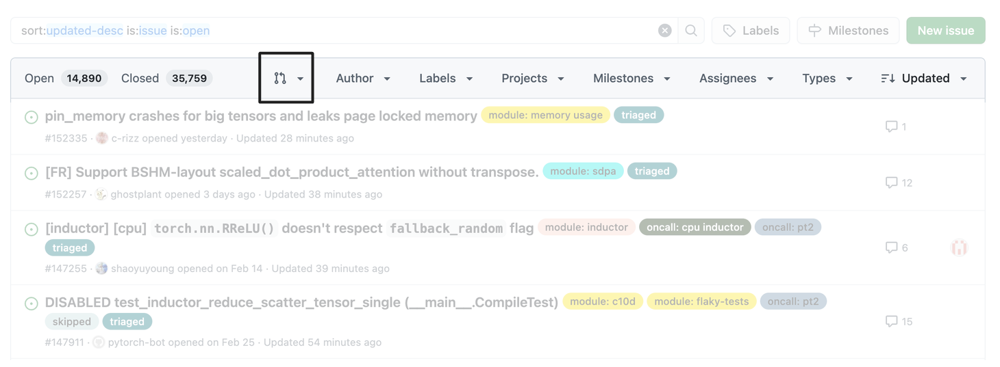
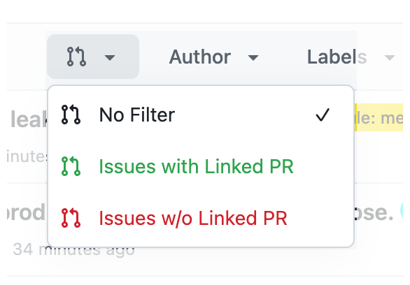
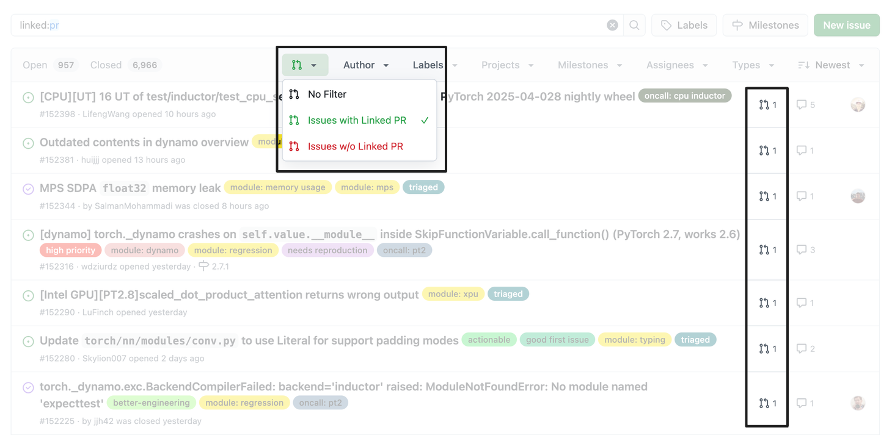
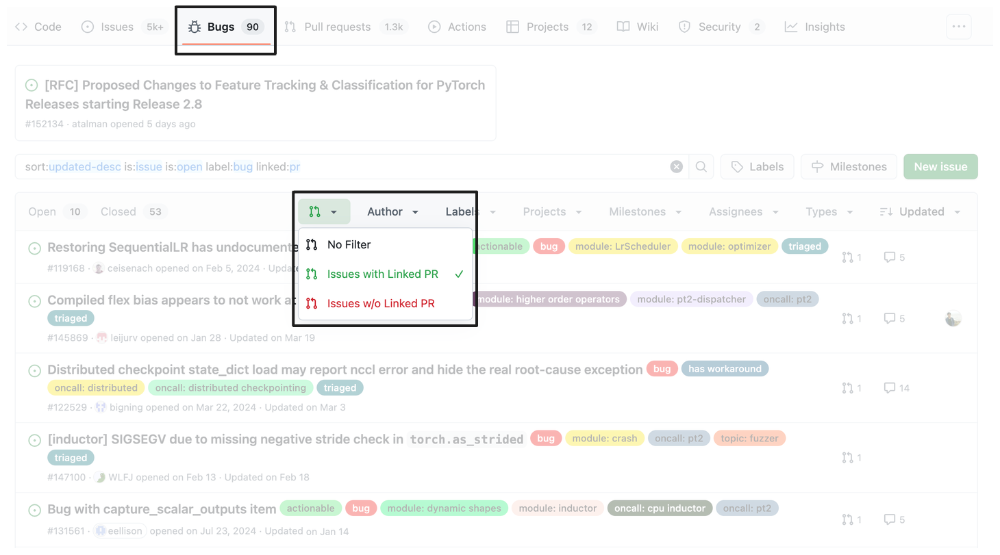

#  noPR: Filter GitHub Issues with(out) Linked PR

> Browser extension that adds a simple filter to GitHub issues page to show issues with or without linked pull requests



Working with open source projects often requires identifying which issues have associated pull requests and which don't, to avoid multiple people working on the same issue. Github supports this filtering with the `linked:pr` search syntax, but it can be cumbersome to remember and type out each time. This extension makes that task easy with a simple dropdown filter in the GitHub issues toolbar. 

## Install

[link-chrome]: https://chrome.google.com/webstore/detail/dlnlangdknflcflghjooahacifckneeg 'Version published on Chrome Web Store'
[link-firefox]: https://addons.mozilla.org/firefox/addon/nopr-filter/ 'Version published on Mozilla Add-ons'

[][link-chrome] [][link-chrome] and other Chromium browsers

[][link-firefox] [][link-firefox]

Or [install locally](#install-locally) from source.

## Features

<table>
    <tr>
    <th width="50%">
      <p>Seamless integration with GitHub's UI</p>
      <p></p>
    </th>
    <th width="50%">
      <p>Easy dropdown menu with one-click filtering</p>
      <p></p>
    </th>
  </tr>
  <tr>
    <th width="50%">
      <p>Filter issues with (or without) linked PRs</p>
      <p></p>
    </th>
    <th width="50%">
      <p>Supports refined-github Bugs tab</p>
      <p></p>
    </th>
  </tr>
</table>

## How It Works

After installation, the extension adds a visually distinctive pull request icon to GitHub's issue toolbar.

1. Navigate to any GitHub repository's issues page
2. Look for the pull request icon in the issues toolbar
3. Click it to show the dropdown menu
4. Select your desired filtering options
    - **No Filter**: Show all issues (default)
    - **Issues with Linked PR**: Show only issues that have associated pull requests
    - **Issues w/o Linked PR**: Show only issues that don't have associated pull requests

The filter works by adding `linked:pr` or `-linked:pr` to GitHub's search query, making use of GitHub's built-in search functionality.


## Install Locally

If you prefer to install the extension directly from source, click to expand the instructions below.

<details>

<summary>Local Installation Instructions</summary>

### Chrome / Edge / Brave (and other Chromium browsers)

1. Download or clone this repository:
   ```
   git clone https://github.com/sshkhr/noPR.git
   ```

2. Open Chrome and navigate to `chrome://extensions/`

3. Enable "Developer mode" in the top-right corner

4. Click "Load unpacked" and select the downloaded/cloned directory

5. The extension should now be installed and active on GitHub issue pages

### Firefox

1. Download or clone this repository:
   ```
   git clone https://github.com/sshkhr/noPR.git
   ```

2. Open Firefox and navigate to `about:debugging#/runtime/this-firefox`

3. Click "Load Temporary Add-on..."

4. Select the `manifest.json` file from the downloaded/cloned directory

5. The extension will be installed temporarily (until Firefox is restarted)

Note: For permanent installation in Firefox, the extension needs to be signed by Mozilla.

</details>

## Contributing

Please see [CONTRIBUTING.md](CONTRIBUTING.md) for development setup and contribution guidelines. If you find any bugs or errors, please open an issue or send a pull request.

## License

This project is licensed under the MIT License - see the LICENSE file for details.

## Acknowledgments

- GitHub for their excellent search API and `linked:pr` search syntax
- [Refined GitHub](https://github.com/refined-github/refined-github) extension for inspiration and UI design patterns